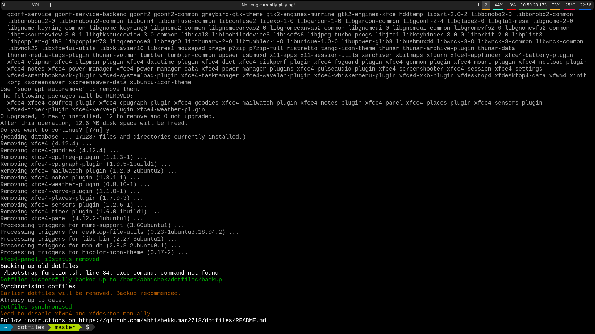

# Dotfiles

[Dotfiles](https://wiki.archlinux.org/index.php/Dotfiles) are user-specific application configurations.

I have spent a lot of time configuring and adjusting my desktop. Setting up new VM or even desktops is difficult and error-prone. In true Linux tradition, I made a few helper scripts to automate the proccess. Feel free to use it in any way you see fit.

Here's what my desktop looks like:


## Installation

For **Ubuntu** and **Arch Linux** users, use the helper script as -
```
git clone https://github.com/abhishekkumar2718/dotfiles;
cd dotfiles;
sudo ./bootstrap.sh
```




Be sure to accept all conditions and pay attention to errors, if any.

At the end of proccess, follow step 4 of manual installation onwards.

In case of other distributions, follow these instructions:

1. Install dependenices which are - `i3`, `xfce4`, `vim`, `rofi`, `polybar` and `arc-gtk-theme`, `powerline-shell`. 
2. Remove packages `xfce4-panel`, `i3status`.
3. Run `bootstrap_other.sh` which backups your existing dotfiles and synchronises them with versions present in 
```
./bootstrap_others.sh
```
4. [Deactivating Xfce's window manager](http://feeblenerd.blogspot.com/2015/11/pretty-i3-with-xfce.html)
**Note**: Follow only the sixth step of tutorial. All other steps have done by helper scripts.
5. Restart your system
6. Enjoy your fancy new system

## Feature requests and contribution

Feel free to add issues, or pull requests. I am glad to know if anyone finds my setup impressive.
